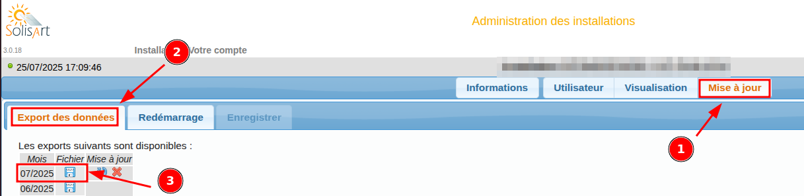
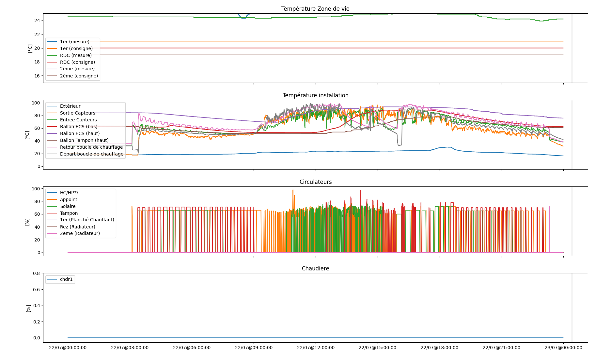

# Solisart Data Visualization Tool

A Python script for visualizing and analyzing data from Solisart solar heating systems. This tool processes CSV data files and generates comprehensive charts showing temperature readings, circulator status, and boiler information.

## Disclaimer

**Important Notice**: This tool is an independent, open-source project created for personal use and educational purposes. I am NOT affiliated with, endorsed by, or related to the Solisart company or its products in any way. This software is provided "as is" without any warranties or guarantees. Use at your own risk and discretion.

## Features

- **Multi-panel visualization** with 4 different chart types:
  - Temperature Zone de vie (Living areas temperature)
  - Temperature installation (Installation temperature)
  - Circulateurs (Circulators status)
  - Chaudiere (Boiler information)
- **Interactive plotting** with matplotlib MultiCursor for synchronized crosshairs
- **Data filtering** by specific day of the month
- **Automatic data cleaning** to remove invalid entries

## Requirements

- Docker

## Installation

1. Clone or download this repository
2. Make the script executable:
```bash
chmod +x run_visualization.sh
```

## Usage

#### Setup X11 forwarding (run once per session)
```bash
xhost +local:docker
```

#### Run with the shell script (recommended)
```bash
./run_visualization.sh <csv_file_path> <day_of_month>
```

**Example:**
```bash
./run_visualization.sh ./example/donnees-SC2M202XXXX-2025-07.csv 22
```

The script will automatically:
- Build the Docker image if needed
- Set up proper volume mounts
- Run the visualization with the specified parameters

Note:
You have to download manually your csv data as per illustrated here:


### Parameters

- `csv_file_path`: Path to the CSV data file to process
- `day_of_month`: Day of the month to display (1-31)

### Advanced Usage

For advanced users who prefer direct Docker commands, see the detailed Docker command in the `run_visualization.sh` script.

This will:
1. Clean the CSV file by filtering data for the specified day of each month
2. Create a cleaned version with `.clean.csv` suffix
3. Generate an interactive plot with 4 subplots showing different system metrics



## Data Format

The script expects CSV files with the following columns:
- `Date`: Timestamp in format "DD/MM/YY HH:MM"
- Temperature columns: `TZ1`, `TZ2`, `TZ3`, `Text`, `Tcapt`, etc.
- Circulator columns: `HC/HP`, `APP`, `SOL`, `BTC`, `C1`, `C2`, `C3`
- Boiler columns: `chdr1`

## Output

The script generates an interactive matplotlib window with:
- Synchronized time axis across all subplots
- MultiCursor for precise data point inspection
- Legend for each data series
- Automatic scaling and formatting

## X11 Forwarding Setup (Docker)

For Docker usage, you need to enable X11 forwarding to display matplotlib windows on your host system:

### One-time setup (per session)
```bash
xhost +local:docker
```

## License

This project is licensed under the GNU General Public License v3.0 - see **SPDX-License-Identifier:** GPL-3.0-or-later

## Contributing

Contributions are welcome! Please feel free to submit a Pull Request.

## Author

Thomas Le Guillou - 2025